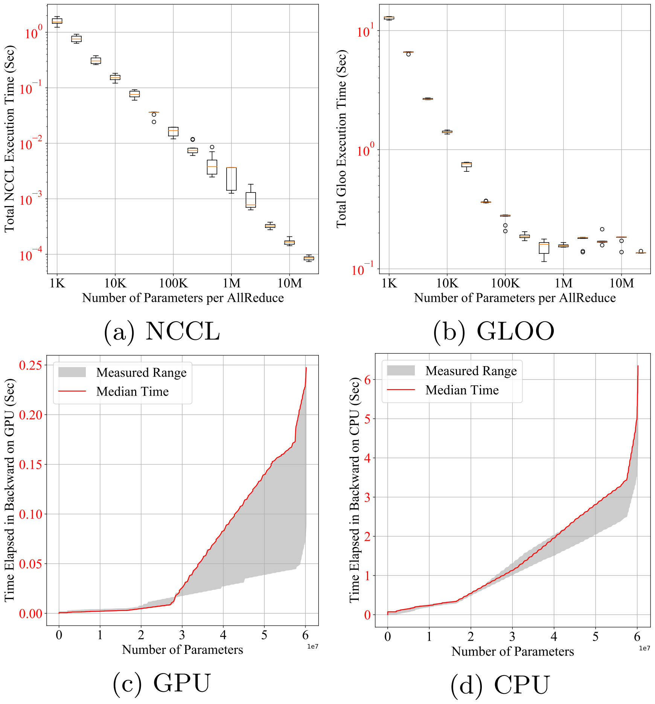
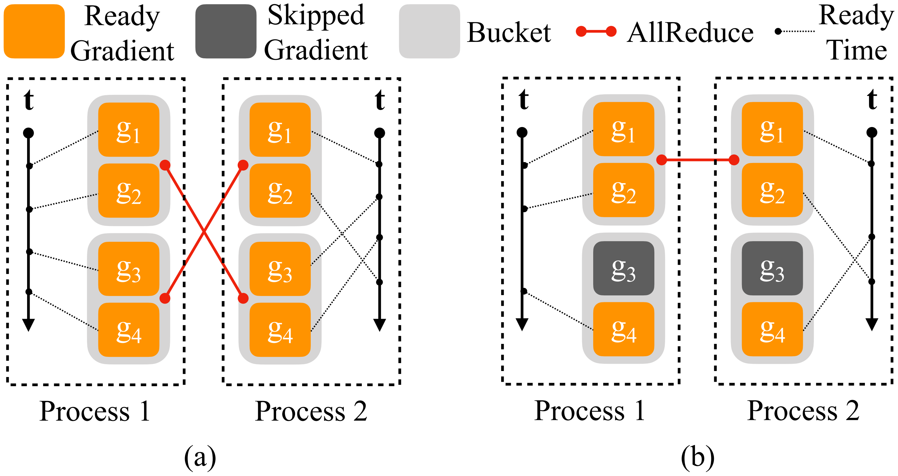

!!! abstract "前言"

    我还记得PyTorch 1.4发布时，看到PyTorch的分布式有新的改动后还专门浪费了一个下午的时间去查DDP，研究NCCL等等。然鹅，一知半解的我在面试时被问到PyTorch的分布式通信之后瞬间败下阵来555555（其实下来想想还是可以苟苟的……）。商汤的面试，总能带给你无尽的惊吓。崩完找我廖哥求安慰时才发现他也没搞清嘿嘿，瞬间轻松了不少。所以，就有了我们今天的这篇文章~

本文对PyTorch 1.6.0的`torch.distributed`进行简要描述。

## 历史

在开始正文之前我们先简要回顾一下PyTorch的历史。

### PyTorch

PyTorch将数据组织为张量（也就是一个n维数组）；而模块定义了将输入到输出的转换，其中模块的前向传播过程在他的成员函数`forward`中定义。一个应用由他的模块通过在`forward`函数中定义的多个原生模块（`nn.Linear`、`nn.Conv2d`）、用户自定义的模块（`backbone`、`neck`、`head`）和函数（`nn.ReLU`）的组合而构成。典型的训练迭代包括使用输入和标签产生损失的前向传播，计算参数的梯度的反向传播以及使用梯度更新参数的优化器步进。更具体地说，在前向传播中PyTorch会构建一个自动梯度图来记录所执行的动作。然后在反向传播中，它使用自动梯度图进行反向传播以生成梯度。最后，优化器将梯度应用于更新参数。训练反复重复这三个步骤直到模型收敛。

### PyTorch并行训练

随着训练数据的增广以及模型规模的扩大，分布式训练的重要性也越来越强。PyTorch首先在`multiprocessing`的基础上提出了`torch.multiprocessing`，但由于进程间通信的限制而带来了种种局限（如CUDA API要求导出到其他进程的分配在仍被使用时保持有效）。随后，PyTorch在0.1中提出了改进的`nn.DataParallel`，它使用单进程多线程的方式，在每次前向过程中通过`scatter`将数据分配给GPUs，调用`replica`函数在各个GPU上创建模型的副本，然后使用`parallel_apply`在各个GPU上完成前向传播，并通过`gather`将所有输出聚集到首张GPU上得到损失，接着损失被`scatter`到GPUs上进行反向传播得到梯度，最后梯度被`all_reduce`到GPU0上更新权重。我们可以发现，这种方式会对GPU0产生巨大的压力，而单进程多线程的方式也不允许在多台机器上分布式的训练。随后，PyTorch在0.3.0中引入了`nn.DistributedDataParallel`以解决这些问题，并在1.0中引入了c10d模块来替代传统的THD以大幅提升通信效率。但随着模型的增大，单台机器已经不能容下整个模型，而且`nn.DistributedDataParallel`并不适合参数服务器，PyTorch又在1.3中引入了`distributed.rpc`来解决这些问题。

## 结构

对于现行版本，`torch.distributed`由以下三个重要组成部分构成。

!!! success "分布式数据并行 - Distributed Data-Parallel (DDP)"

    DDP是最常见的多GPU训练范式，它支持多机多卡训练，并允许将模型分布在同一主机的多张显卡中。

!!! success "远程过程调用 - RPC-Based Distributed (RPC)"

    RPC旨在支持不适用于数据并行训练的常规训练结构，例如分布式管道并行（模型分布于多台主机上），参数服务器范式（模型参数与训练器位于不同机器上）以及DDP与其他训练范式的组合。

!!! success "聚合通信 - Collective Communication (c10d)"

    C10d库支持组内进程间的张量发送。他提供聚合通信API（如`all_reduce`和`all_gather`）以及P2P通信API（如`send`和`isend`）。DDP和RPC（进程组后端）在v1.6.0中都基于c10d，其中前者使用聚合通信，而后者使用P2P通信。C10d是一个低级的通信API，仅对后端的原语进行封装，而在此基础上的DDP和RPC能满足大多数分布式训练方案的需求，因此开发人员通常无需使用这个API。事实上，直接调用这个API也是被不建议的，因为手动调用此API进行通信和计算将无法应用到DDP和RPC的性能优化。但在某些情况下，此API仍然很有帮助。一个示例是分布式参数平均，其中应用程序希望在反向传播之后计算所有模型参数的平均值，而不是使用DDP来传递梯度。这可以使通信与计算脱钩，并允许对通信内容进行更细粒度的控制。[使用PyTorch编写分布式应用程序](https://pytorch.org/tutorials/intermediate/dist_tuto.html)提供了使用c10d API通信的示例。

## 分布式数据并行（DDP）

DDP在每个计算资源（GPU）上创建模型副本来独立的生成梯度，然后在每个迭代中交流这些梯度使得模型副本一致。PyTorch使用了多种技术来加速并行运算，包括梯度合桶（bucketing gradients）、计算通信重叠（overlapping computation with communication）以及梯度同步跳过（skipping gradient synchronization）。评估表明，PyTorch可以在256个GPU上达到接近线性的可扩展性。

{: align=right loading=lazy style="width:40%"}
DDP的每一个进程都对应一个独立的训练过程，它拥有自己的模型副本，自己的优化器，当然也控制一张GPU。DDP通过确保以下两点来确保算法的正确性（即其训练结果与单卡训练结果一致）。

1. 所有模型副本的初始状态相同
2. 所有优化器每次步进使用的参数梯度相同

DDP的结构如右图所示，它主要包括了Python API和C++的梯度下降算法。所有的通信通过c10d调用底层通信框架。

DDP的API与DP类似，均是一个模组。在本文中，我们将忽略接口的设计而关注底层的运算流程。如果你对其感兴趣，我们鼓励你阅读[PyTorch Distributed: Experiences on Accelerating Data Parallel Training](https://arxiv.org/pdf/2006.15704.pdf)的第3.1节以获得更多细节。

### 梯度规约

DDP的梯度规约一直在进化，让我们从一个简单的算法开始并逐步理解现行版本中的算法。

回顾我们之前提到的，DDP通过确保所有模型副本的初始状态相同和所有优化器每次步进使用的参数梯度相同来确保算法的正确性。我们很容易想到，前者可以很简单的通过在构建DDP时将模型母本广播到所有进程来实现。后者则可以通过在反向传播与优化器步进之间插入一个梯度同步阶段，通过`AllReduce`聚合通信来计算每个参数的梯度的平均值并将结果同步给每个进程以实现。但这样会带来两个问题：

1. 聚合通信在小张量上的表现不佳，这在带有大量小参数的大型模型上尤为突出。
2. 梯度的计算与同步被分为两个阶段，这使得我们无法通过计算通信重叠来提高模型效率。

#### 梯度合桶（bucketing gradients）

{: align=right loading=lazy style="width:60%"}
聚合通信在小张量传输上的表现欠佳，但它的性能随着张量的尺寸增大而提升。右图的a、b子图展示了一个60MiB大小的`torch.float32`参数相对于每次`AllReduce`不同数量的参数的总运行时间。为了最大化带宽利用，`AllReduce`操作被设计为异步调用，并在反向传播时阻塞。我们可以发现，DDP等待较短时间后将多个梯度存储到一个桶里后执行一个`AllReduce`操作可以显著降低通信延迟。右图的c、d子图展示了一个包含大约60M个参数的ResNet152网络的反向传播计算时间，其中x轴代表就虚的梯度的数量。GPU上的反向传播大约需要250毫秒以完成，这与NVLink上的NCCL数量级相同。这些实验表明，如果参数桶相对小，DDP可以在反向传播的同时启动`AllReduce`操作，使通信与计算重叠。

#### 计算通信重叠（overlapping computation with communication）

{: align=right loading=lazy style="width:60%"}
通过合桶，DDP仅需要在启动通信之前等待桶中所有的梯度完成计算。此时，在整个网络完成反向传播后再进行`AllReduce`操作便不再足够，而应该在每一个桶完成反向传播后都进行`AllReduce`操作。DDP为每一个梯度累加器注册一个自动求导钩子，并在相应的累加器更新梯度后激活。当一个桶内的所有钩子都被激活时，最后一个被激活的钩子会触发`AllReduce`操作。

!!! warning "进程的规约顺序重要"

    所有进程必须按照相同的顺序进行规约，否则`AllReduce`的结果可能不匹配。如上图的a子图所示，进程2的g2参数在最后被计算出，使得g1&2参数桶在g3&4参数桶后规约，导致两个进程的`AllReduce`错位。因此，所有进程都使用相同的存储顺序，并且i号桶启动AllReduce之前i+1号桶无法启动规约。在PyTorch 1.6中，`model.parameters()`的相反顺序被用作参数桶顺序。假设层以与前向传播中相近的顺序被注册，那么它的反向也即是反向传播中梯度的计算顺序。

!!! warning "每一个迭代中参与训练的网络可能不同"

    一个迭代可能只训练一个模型的子图（比如预热时我们常常固定backbone），并且该子图也可能随着迭代而发生变化。这意味着某些梯度在某些迭代中可能被跳过。但是，梯度到桶的映射是在构建时即被建立的。这使得被跳过的梯度将让某些桶永远无法准备，从而阻塞反向传播过程。如上图的b子图所示，g3参数在某次迭代中被跳过，因此g3&4参数桶无法准备。为了解决此问题，DDP遍历从前向传播的输出张量得到的自动求导图来找到所有的参与参数，然后将未参与的参数直接标记为就绪。

#### 梯度同步跳过（skipping gradient synchronization）

并行训练的最大延迟来源是同步。那么，我们一定要每个迭代都执行同步么？答案自然是否定的。在局部执行n次训练迭代之后再执行一次`AllReduce`可以在很大程度上减少梯度同步。这同时有助于训练一个超大的，无法一次性放入显存的输入批--我们可以将这个批划分成几个小批次，然后在这些小批次上进行前向与反向传播，再当整个批训练完成之后发起梯度同步。

理论上来说，梯度同步跳过的计算结果与不跳过的结果是相同的，因为梯度只是单纯的被累加到了同一个张量上。但上一节提到，每一个迭代中参与训练的网络可能不同，梯度同步跳过与之前提到的措施相冲突。此外，DDP也无法知道接下来的反向传播应当进行梯度累加还是同步，因此PyTorch使用`ddp.no_sync()`以作为累加的标识。
