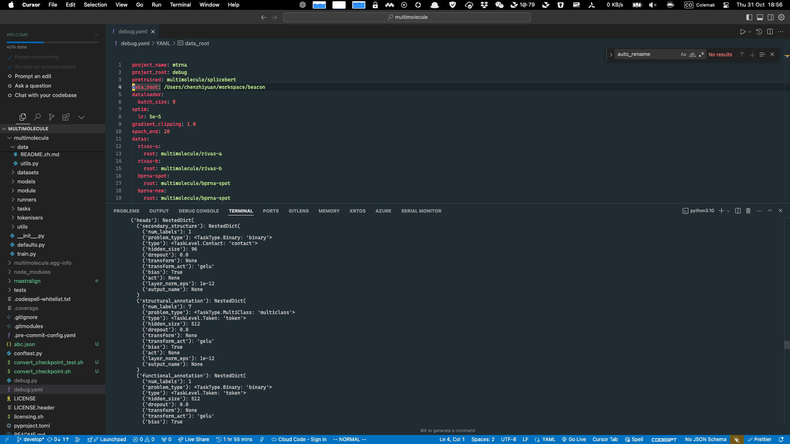

---
authors:
    - zyc
date: 2022-12-12 21:05:52
categories:
    - sketch
tags:
    - sketch
---

# 丹灵的分布式错误 -- 以及我们如何修复他

!!! abstract "摘要"

    基于丹灵开发的两个仓库 -- DeepProtein 和 MultiMolecule 长期以来都饱受一个分布式 bug 的影响。

    具体来说，在多数据集分布式训练时，训练会在某一个 step 莫名其妙卡死。

    这个 bug 是如此顽固，以至于我曾经多次尝试修复，但都没能成功。

    直到最近，我才终于找到了这个 bug 的根源。

## 背景

DeepProtein 和 MultiMolecule 都是基于丹灵开发的训练仓库，他们都有一个我引以为傲的功能：多数据集多任务联合训练。

具体来说，你只要这么定义数据集：

```yaml
datas:
  rivas-a:
    root: multimolecule/rivas-a
  rivas-b:
    root: multimolecule/rivas-b
  bprna-spot:
    root: multimolecule/bprna-spot
  bprna-new:
    root: multimolecule/bprna-spot
  archiveii:
    root: multimolecule/archiveii
  rnastralign:
    root: multimolecule/rnastralign
```

MultiMolecule 就会自动从我们的数据仓库中下载数据，识别有哪些任务，然后构建出任务对应的预测头，并为每个数据集的每个任务构建一个单独的`Metric`来正确评估模型效果。



## 错误

多数据集多任务支持有很多很多问题。事实上，MultiMolecule 作为一个开源版本，功能要更少一些。DeepProtein 是支持训练数据和标签在不同的文件的（虽然我不知道这个功能是否有被任何人用到）……

但其中最重要的，也是困扰我最久的，是分布式训练卡死。

具体来说，在多数据集分布式训练时，训练会在某一个 step 莫名其妙卡死。

只在分布式训练的多数据集场景中出现，单卡多数据集和多卡单数据集都没有问题。并且概率性出现，有时候能完整的跑完一个 epoch，有时候跑两步就卡死。最重要的是，没有任何报错。就是卡死了。然后过半个小时被看门狗 SIGKILL 掉。

在 DP 时，分布式多数据集训练的场景非常罕见，因此尽管我尝试过很多次修复，但都因为有其他更重要的事情而暂时搁置。

而最近要发布开源版本，总不能让他带着这个 bug 出去吧。因此，他终于成为了最高优先级任务。

## 原因

寻找错误点是一件非常头疼的事情。因为没有任何报错，哪怕开了各种 DEBUG 旗帜也没有。因此只能一行行手动打印日志。好在丹灵的 Runner 是有重写 `print` 函数的，因此我可以非常简便的在 `print` 中加入更多信息。

在几天的找寻之后，我终于发现，错误似乎出现在 `Metric` 更新当中。更进一步的分析表明，这是因为，因为不同数据集的任务不一样（比如在此例当中，`bprna-spot`数据集有两个额外任务：`structural_annotation`和`functional_annotation`）。
尽管我们在调用`metric.update`时是按照数据集分开调用的，但不容进程看到的数据集不一样，任务也不一样。此外，由于多数据集多任务的特性，同一个数据集的不同任务在不同显卡上的顺序也不一样。
但这些，`dist.all_reduce`和`dist.all_gather`是不知道的。他们只会傻傻的同步所有进程的数据，而不管他们自己的任务是什么。

## 修复

知道了问题在哪里，一个很自然的想法是，在调用`metric.update`前，首先调用一次`dist.all_gather`来同步当前步参与训练的数据集和任务，并对结果进行排序。这样大家同步的`metric`就都来自同一个数据集的同一个任务了。吗？

其实不是，每个进程看到的任务可以是不一样的。因此，如果只是这样操作的话，那么会有进程不参与同步，还是会导致卡死。
聪明的小伙汁应该能想到，我们可以在同步之后根据每张卡的任务来计算当前应该参与同步的进程有哪些，然后在`metric.update`当中传入一个`process_group`来指定同步的进程。

emmm，想想看，这样的开发成本似乎有些高。有没有什么更简单的办法呢？

如果我们确保每个进程看到的数据集都是一样的，那么不久可以解决这个问题了。PyTorch 的 `DistributedDataLoader` 通过固定随机种子来实现跨进程的数据一致性。
我们完全可以用同样的方式来确保每个进程在每个 step 看到的数据集都是一样的。

这样修复之后，我们终于可以稳定的训练一个 epoch 了。然后在验证的时候又开始出现概率性卡死。

有了之前的经验，我们合理怀疑这是因为不同进程看到的split是不一样的。是的，我们往往要在执行多次验证，至少也要有验证集和测试集。
因此，我们只要在开始训练之前，对数据集的 splits 进行一次排序，这样就能保证每个进程看到的 splits 都是一样的了。

其中当然还遇见了一些其他 PyTorch 的 bug，比如`AverageMeter`使用`dist.all_gather_object`同步时偶尔会试图占用 1EB+ 显存，然后报 OOM，这里掠过不提。

终于，这个困扰我近两年的 bug 被修复了。

<br>

癸卯年霜降

于薄扶林
