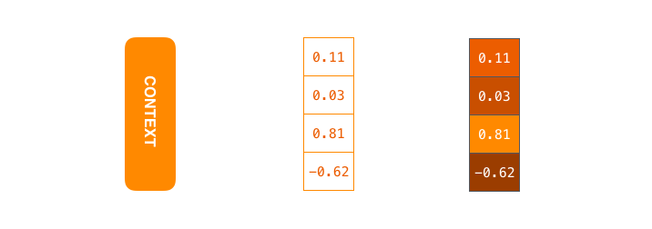

## 介绍

一个序列到序列（Seq2Seq）模型将一个序列转换成另一个序列。

<figure class="video_container">
  <video width="100%" height="auto" loop="" autoplay="" controls="">
    <source src="../attention/seq2seq_1.mp4" type="video/mp4">
  </video>
</figure>

通常，序列到序列模型使用编码器-解码器（encoder-decoder）架构。

<figure class="video_container">
  <video width="100%" height="auto" loop="" autoplay="" controls="">
    <source src="../attention/seq2seq_3.mp4" type="video/mp4">
  </video>
</figure>

在这个架构中，编码器将他捕获到的信息编码成为上下文，然后解码器对其进行解码得到输出。这个架构被广泛的应用在多个任务中，比如神经机器翻译。在这个任务中，编码器将输入从输入语言映射到高层语义，解码器再将高层语义解码成输出语言。
<!-- 从概率学的角度来说，翻译等同于找到一个目标语句$\mathbf{y}$，使得其对于源语句$\mathbf{x}$的条件概率$\operatorname*{arg\,max}_\mathbf{y} p(\mathbf{y} | \mathbf{x})$最大。 -->

<figure class="video_container">
  <video width="100%" height="auto" loop="" autoplay="" controls="">
    <source src="../attention/seq2seq_4.mp4" type="video/mp4">
  </video>
</figure>

对于神经机器翻译任务，输入和输出都为词嵌入。词嵌入的典型大小在200-300之间，为了便于展示，此处为4。

上下文是一个向量。它的大小是一个超参数，通常为256、512或者1024，为了便于展示，此处为4。

循环神经网络通常在神经机器翻译中被用作编码器和解码器。他将第$k-1$步的隐藏态和第$k$步的输入向量作为输入，输出为第$k$步的隐藏态和输出，如图所示：

<figure class="video_container">
  <video width="100%" height="auto" loop="" autoplay="" controls="">
    <source src="../attention/RNN_1.mp4" type="video/mp4">
  </video>
</figure>

下图可视化了循环神经网络在序列到序列模型中的应用，其中，编码器和解码器的每个脉冲表示其进行一次运算。每次运算都会更新隐藏态，而最后一个隐藏态实际上是我们传递给解码器的上下文。

<figure class="video_container">
  <video width="100%" height="auto" loop="" autoplay="" controls="">
    <source src="../attention/seq2seq_5.mp4" type="video/mp4">
  </video>
</figure>

这幅图可能看上去稍有些困难。我们有时也会将循环神经网络按照时间展开，这样，我们就能看到每一步的输入和输出。

<figure class="video_container">
  <video width="100%" height="auto" loop="" autoplay="" controls="">
    <source src="../attention/seq2seq_6.mp4" type="video/mp4">
  </video>
</figure>

注意尽管图中没有画出，但解码器也会维护一个隐藏态。

显然，这个架构的一个潜在问题是编码器需要将所有必要的信息压缩到定长的上下文中，解码器则需要从这个定长的上下文中解码出所有内容。这使得这类网络难以应付较长的输入和输出。

## 方法

本文通过在训练中联合的进行对齐和翻译来解决这个问题。在预测下一个词时，模型首先会（软）搜索并关注源句子中具有最相关的信息的一组位置，然后基于与这些源位置和所有先前生成的目标词关联的上下文来预测目标词。

本文所提出的方法与基础的编码器-解码器最重要的区别是，他不试图去将整句话编码成一个定长的上下文，而是将输入语句编码成多个上下文构成的序列，解码时自适应的从上下文序列中选取一个子集进行解码。这样一来，模型就不再需要将源句中蕴含的所有信息压缩到一个定长的上下文中。从而使模型能够更好的应对较长的句子。

<figure class="video_container">
  <video width="100%" height="auto" loop="" autoplay="" controls="">
    <source src="../attention/seq2seq_7.mp4" type="video/mp4">
  </video>
</figure>

如图所示，在编码阶段，与传统的基于循环神经网络的序列到序列模型只将最后一个隐藏态作为上下文不同，带有注意力的序列到序列模型将输入阶段的所有隐藏态作为上下文。这使得上下文的大小可以与输入的大小呈线性关系，从而在很大程度上缓解模型难以应对较长的输入的问题。

<figure class="video_container">
  <video width="100%" height="auto" loop="" autoplay="" controls="">
    <source src="../attention/seq2seq_8.mp4" type="video/mp4">
  </video>
</figure>

需要注意的是，注意力解码器与此前有了很大不同：在对上下文进行解码之前，它需要根据注意力解码器的隐藏态（查询，query）对每个隐藏态（键，key）进行一个评分，然后将隐藏态（值，value）乘以其$softmax$后的评分来抑制评分较低的隐藏态，最后将所有隐藏态加和来得到当前步的上下文。这使得解码器能注意到最与当前步相关的上下文。对于本模型来说，键和值实际上一样，但理论上他们可以有所不同。

评分的计算方式则多种多样，通常来说，这表示了查询与键之间的相关性。因此，它可以为查询与键之间的点积、余弦相似度，甚至可以将两者连接之后通过一个多层感知机来计算。

<figure class="video_container">
  <video width="100%" height="auto" loop="" autoplay="" controls="">
    <source src="../attention/attention_process.mp4" type="video/mp4">
  </video>
</figure>

现在，我们可以把整个流程串到一起：

<figure class="video_container">
  <video width="100%" height="auto" loop="" autoplay="" controls="">
    <source src="../attention/attention_tensor_dance.mp4" type="video/mp4">
  </video>
</figure>

1. 注意力解码器输入<END>令牌的词嵌入和解码器初始隐藏态，得到输出和新隐藏态（h4）
2. 使用上下文与h4向量来计算当前步的上下文C4
3. 将h4和C4连接到一起，送入前馈神经网络得到当前步的输出
4. 重复1

<figure class="video_container">
  <video width="100%" height="auto" loop="" autoplay="" controls="">
    <source src="../attention/seq2seq_9.mp4" type="video/mp4">
  </video>
</figure>
