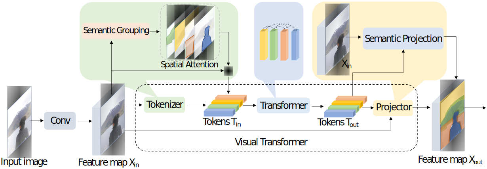
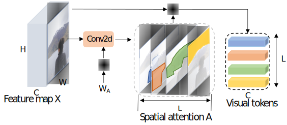
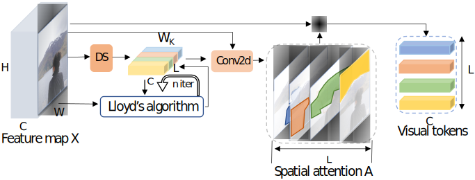

## 介绍

卷积和循环运算都

1. **并非像素皆生而平等** ：图像分类模型应当主要关注前景对象而忽略背景。然而卷积运算平等的处理图像的每一个子区域，而无论其重要性。这使得计算和表示的空间效率低下。
2. **​​不是所有概念都会在所有图像中出现** ：所有自然图像中都存在诸如拐角和边缘之类的低级特征，因此将低级卷积滤波应用于所有图像是合适的。然而，高级特征（例如耳形）仅存在于某些特定图像中。然而，卷积神经网络在所有图像中显式建模所有概念而无论内容，很少使用的、不适用的卷积层花费了大量的计算。
3. **难以建立空间距离较大的概念之间的联系** ：语义概念之间的远距离交互至关重要，但卷积滤波器只能在一个较小的区域上运算。为了关联远距离的概念，传统的方法包括增加卷积核大小、增加模型深度或采用新的运算如膨胀卷积、全局池化和非局部注意层。但是，这样的方法并没有摆脱像素-卷积范式，因而只能缓解而不能解决问题，并会导致模型和计算复杂度的增加。

本文提出Visiual Transformer（VT），一个新的表达和处理图像中高层概念的范式来解决这个问题。本文认为，仅有数个单词（或者视觉令牌）的序列足以描述图像的高层概念。因此，本文在网络的后半部分采用了空间注意力来将特征图转换成一组紧凑的语义令牌，然后将其送入Transformer中来捕获令牌间的交互。网络输出的视觉令牌可以直接被用于图像级的预测任务（如分类），或者也可以在空间上重新投影到特征图中来用于像素级的预测任务（如分割）。VT的优势包括：

1. 关注重要的图像区域
2. 对在图像相关的视觉令牌中的语义概念进行编码
3. 通过令牌空间的自注意力来建立空间距离较远的概念之间的联系

!!! important ""
    Visual Transformer在语义令牌空间中运作，根据上下文来处理不同的图像部分。相比传统的像素空间的Transformer可以节省海量计算。

## Visual Transformer

对于输入图片，本文首先应用卷积层来提取低层特征。输出的特征图被输入VT：首先，令牌器将像素分组为少量视觉令牌，每个视觉令牌都表示图像中的语义概念。然后，应用Transformer来建模令牌之间的关系。视觉令牌被直接应用于图像分类或者映射会特征图以进行语义分割。

### 结构

图1描述了Visual Transformer的结构。在本文中，输入图像总共会经过两个阶段：第一个阶段由数个卷积块构成，负责提取图像中密集分布的低级模式；第二个阶段是VT，负责学习和关联稀疏分布的高级语义概念。

VT模块包括三个步骤：第一步将像素分组成语义概念来产生一个较小的视觉令牌集；第二步对这些视觉令牌应用Transformer来建模语义概念的关系；第三步将语义令牌映射回像素空间以获得增强的特征图。

### 令牌器

令牌器从特征图$\mathbf{X} \in \mathbb{R}^{H \cdot W \times C}$中提取视觉令牌$\mathbf{T} \in \mathbb{R}^{L \times C}$ s.t. $L \ll H \cdot W$，其中L代表视觉令牌的数量。

#### 滤波器基令牌器（卷积令牌器）

如图2所示，滤波器基令牌器利用卷积来提取视觉令牌。对于特征图$\mathbf{X}$，本文将其中的每个像素$\mathbf{X}_p \in \mathbb{R}^C$通过逐点卷积来映射到$L$个语义组之一。然后，对每个语义组空间池化来获得令牌$\mathbf{T}$。

\begin{equation}
    \begin{aligned}
        \mathbf{T} = {\underbrace{\operatorname{softmax}_{_{HW}}\left(\mathbf{X}\mathbf{W}_A\right)}_{\mathbf{A} \in \mathbb{R}^{HW\times L}}}^T \mathbf{X} && 1
        %= \mathbf{A}^T \mathbf{X}
    \end{aligned}
\end{equation}

其中，$\mathbf{W}_A \in \mathbb{R}^{C\times L}$从$\mathbf{X}$中构建语义组；$\operatorname{softmax}_{_{HW}}(\cdot)$将激活映射成空间注意力；$\mathbf{A}$与$\mathbf{X}$进行点乘，然后计算加权平均值来获得视觉令牌$\mathbf{T}$。

但是，许多高级语义概念是稀疏的，可能每个仅在少数图像中出现。因此，固定的一组学习权重$\mathbf {W}_A$可能会浪费计算量。

#### 簇基令牌器（循环令牌器）

为了弥补基于过滤器的令牌生成器的局限性，本文提出了循环令牌生成器。如图3所示，通过让上一层的令牌$\mathbf{T}_{in}$来指导当前层的新令牌的提取，使得VT可以根据先前处理的概念逐步完善视觉令牌集。

\begin{equation}
    \begin{aligned}
        \begin{gathered}
            \mathbf{W}_R = \mathbf{T}_{in}\mathbf{W_{T \rightarrow R}} \\
            \mathbf{T} = \operatorname{softmax}_{_{HW}}\left(\mathbf{X}\mathbf{W}_R\right)^T \mathbf{X}
        \end{gathered} && 2
    \end{aligned}
\end{equation}

其中$\mathbf{W}_{T \rightarrow R} \in \mathbb{R}^{C \times C}$。

本文从第二个VT模块开始应用循环令牌生成器，因为循环令牌器需要来自先前VT模块的令牌。

### Transformer

本文采用了一个有极少改动的标准Transformer架构，如公式3。

\begin{equation}
    \begin{aligned}
        \mathbf{T}_{out}' &= \mathbf{T}_{in} + \operatorname{softmax}_{_L} \left((\mathbf{T}_{in}\mathbf{K}) (\mathbf{T}_{in}\mathbf{Q})^T\right) \mathbf{T}_{in} && 3 \\
        \mathbf{T}_{out} &= \mathbf{T}_{out}' + \operatorname{ReLU}(\mathbf{T}_{out}'\mathbf{F}_1)\mathbf{F}_2 && 4
    \end{aligned}
\end{equation}

其中，$\mathbf{T}_{in}, \mathbf{T}_{out}', \mathbf{T}_{out} \in \mathbb{R}^{L\times C}$是视觉令牌。

在自注意力之后，本文使用了两个逐点卷积，如公式4。

### 映射器

针对需要像素级细节的任务，本文通过将视觉令牌映射回像素空间来将Transformer的输出与原始特征图融合，如公式5所示。

\begin{equation}
    \begin{aligned}
        \begin{gathered}
            \mathbf{X}_{out} = \mathbf{X}_{in} + \operatorname{softmax}_{_L}\left((\mathbf{X}_{in} \mathbf{W}_Q) (\mathbf{T}\mathbf{W}_K)^T \right) \mathbf{T}
        \end{gathered} && 5
    \end{aligned}
\end{equation}

其中$\mathbf{X}_{in}, \mathbf{X}_{out} \in \mathbb{R}^{HW\times C}$代表输入、输出特征图，$(\mathbf{X}_{in} \mathbf{W}_Q) \in \mathbb{R}^{HW\times C}$是从输入特征图计算得到的query。$(\mathbf{X}_{in} \mathbf{W}_Q)_p \in \mathbb{R}^C$编码像素$p$从视觉令牌中获取到的信息。$(\mathbf{T}\mathbf{W}_K) \in \mathbb{R}^{L\times C}$是从令牌中计算得到的key。$(\mathbf{T}\mathbf{W}_K)_l \in \mathbb{R}^C$表示第$l$个令牌编码的信息。key-query点乘确定如何将视觉令牌$T$中编码的信息映射到原始的特征图中。$\mathbf{W}_Q \in \mathbb{R}^{C\times C}, \mathbf{W}_K \in \mathbb{R}^{C\times C}$是可学习的权重，用于计算query和key。

| Models        | Top-1 Acc (%) | FLOPs (G)      | Params (M)    |
|---------------|----------------|----------------|---------------|
| R18           | 69.8           | 1.814          | 11.7          |
| R18+SE        | 70.6           | 1.814          | 11.8          |
| R18+CBAM      | 70.7           | 1.815          | 11.8          |
| LR-R18        | 74.6           | 2.5            | 14.4          |
| R18(ours)     | 73.8           | 1.814          | 11.7          |
| VT-R18(ours)  | **76.8**       | **1.569**      | **11.7**      |
| R34           | 73.3           | 3.664          | 21.8          |
| R34+SE        | 73.9           | 3.664          | 22.0          |
| R34+CBAM      | 74.0           | 3.664          | 22.9          |
| AA-R34        | 74.7           | 3.55           | 20.7          |
| R34(ours)     | 77.7           | 3.664          | 21.8          |
| VT-R34(ours)  | **79.9**       | **3.236**      | **19.2**      |
| R50           | 76.0           | 4.089          | 25.5          |
| R50+SE        | 76.9           | 3.860*         | 28.1          |
| R50+CBAM      | 77.3           | 3.864*         | 28.1          |
| LR-R50        | 77.3           | 4.3            | 23.3          |
| Stand-Alone   | 77.6           | 3.6            | **18.0**      |
| AA-R50        | 77.7           | 4.1            | 25.6          |
| $A^2$-R50     | 77.0           | -              | -             |
| SAN19         | 78.2           | **3.3**        | 20.5          |
| GloRe-R50     | 78.4           | 5.2            | 30.5          |
| VT-R50(ours)  | **80.6**       | 3.412          | 21.4          |
| R101          | 77.4           | 7.802          | 44.4          |
| R101+SE       | 77.7           | 7.575*         | 49.3          |
| R101+CBAM     | 78.5           | 7.581*         | 49.3          |
| LR-R101       | 78.5           | 7.79           | 42.0          |
| AA-R101       | 78.7           | 8.05           | 45.4          |
| GloRe-R200    | 79.9           | 16.9           | 70.6          |
| VT-R101(ours) | **82.3**       | **7.129**      | **41.5**      |
